## Instancia EC2:

Las instancias cambian de IP cada vez que las inicias, para que mantenga la misma IP se le añade una IP elástica:
Cómo conseguir una IP fija en EC2 (Elastic IP)

Pasos sencillos desde la consola AWS:

    - Entra a AWS Console → EC2 → Network & Security → Elastic IPs

    - Haz clic en Allocate Elastic IP address

    - Presiona Allocate (deja la región por defecto donde está tu instancia)

    - Luego selecciona la IP recién creada → clic en Actions → Associate Elastic IP address

    - Elige tu instancia EC2 y confirma.

Cambia la IP por la IP Elástica que acabamos de crear.
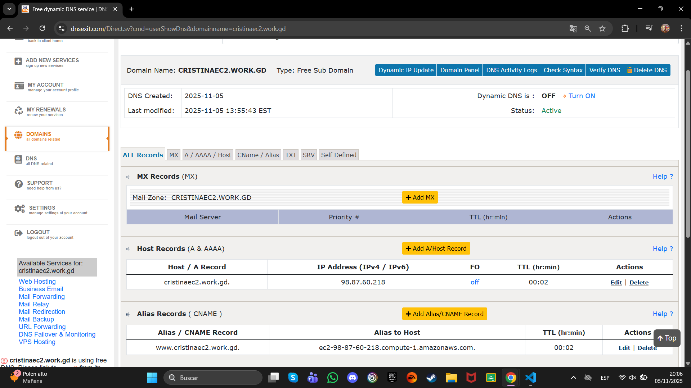

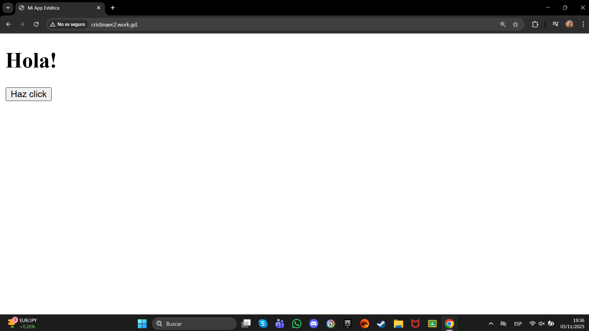

URL: www.cristinaec2.work.gd.

(Como solo se puede tener 3 DNS gratuitos he decidido, después de crearla y ver que funciona, borrarla para poder hacer las demás)

## Bucket S3

Se usa la URL que aparece en el apartado de propiedades al final en Alojamiento de sitios web estáticos

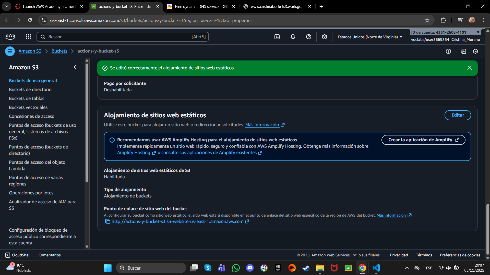

Borramos la direccion IPv4 que aparecía.
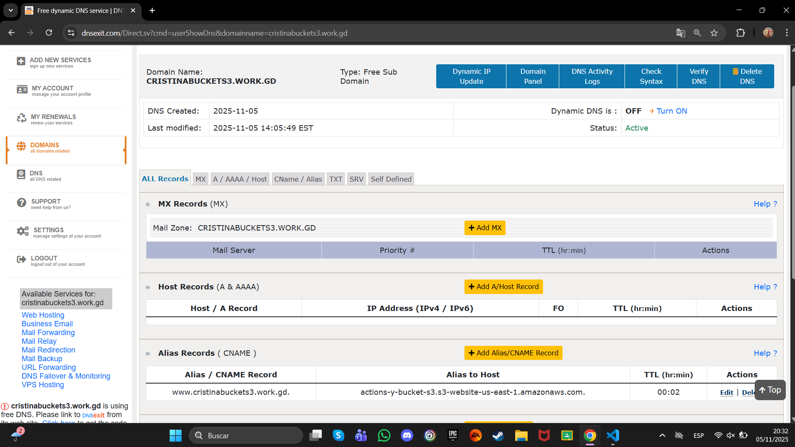

NO ENTIENDO EL FALLO
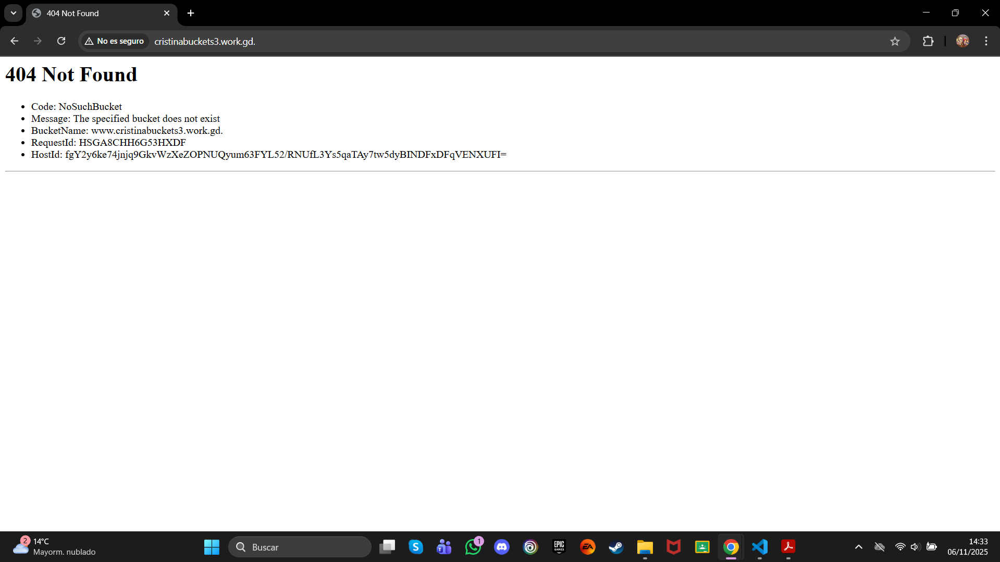

URL: www.cristinabuckets3.work.gd.

## Vercel

Dentro de nuestro repositorio en Vercel, nos vamos al apartado Settings -> Domains y añadimos un Domain nuevo.

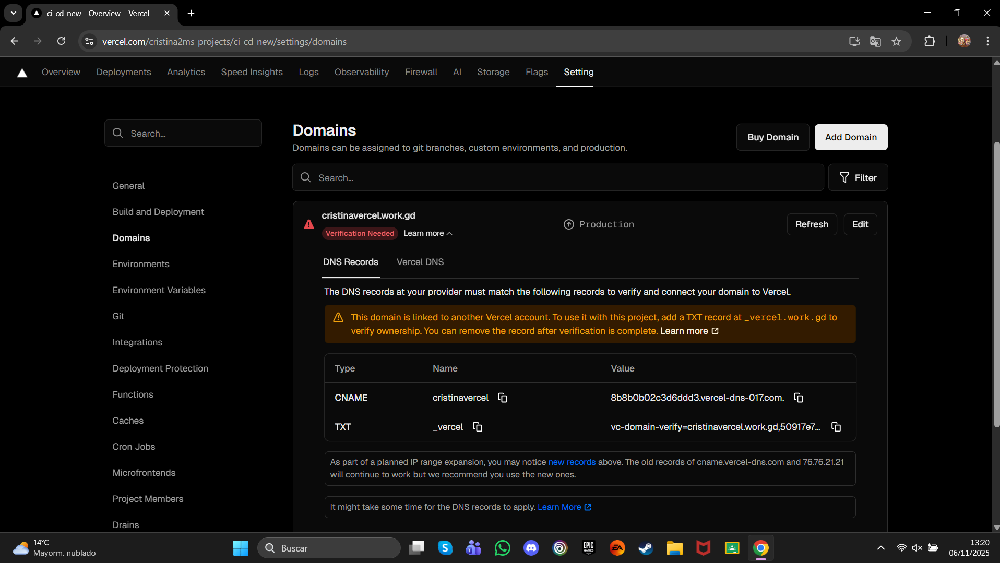
Nos aparece que debemos hacer un CNAME y un TXT

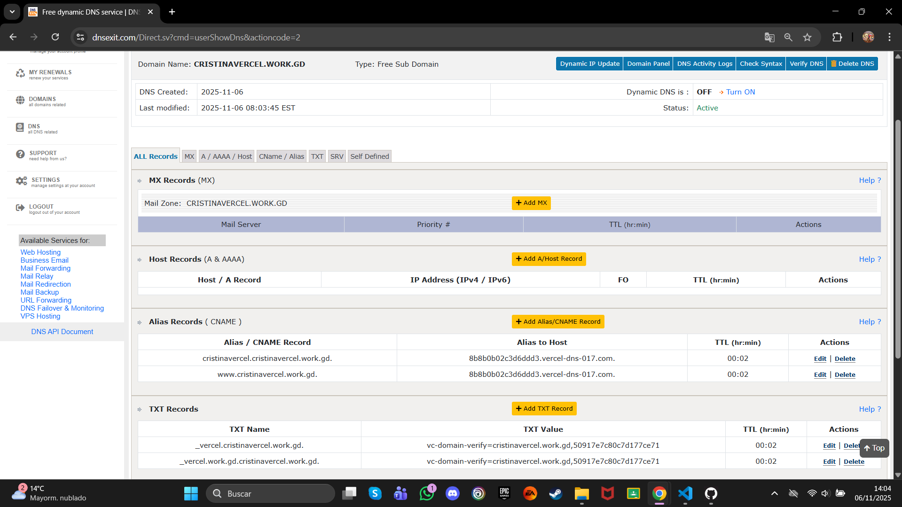

NO ENTIENDO EL FALLO
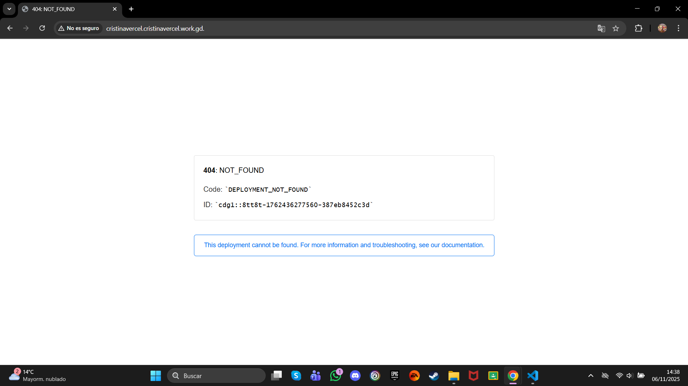

URL: cristinavercel.cristinavercel.work.gd.
URL: www.cristinavercel.work.gd.

## Git Pages

En GitHub, en el apartado de Pages, hay que bajar hasta Custom domain.
Ahí pegamos la url que hemos creado en DNSEXIT sin el punto final.

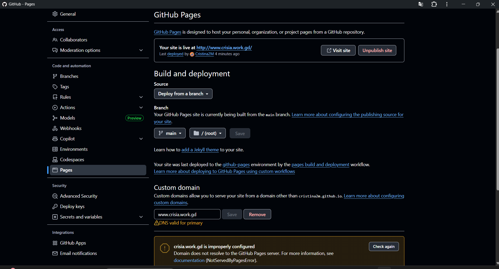

Borramos la direccion IPv4 que aparecía y modificamos el CNAME poniendo nuestra URL de GitHub sin el nombre del repositorio añadiendo un punto al final.
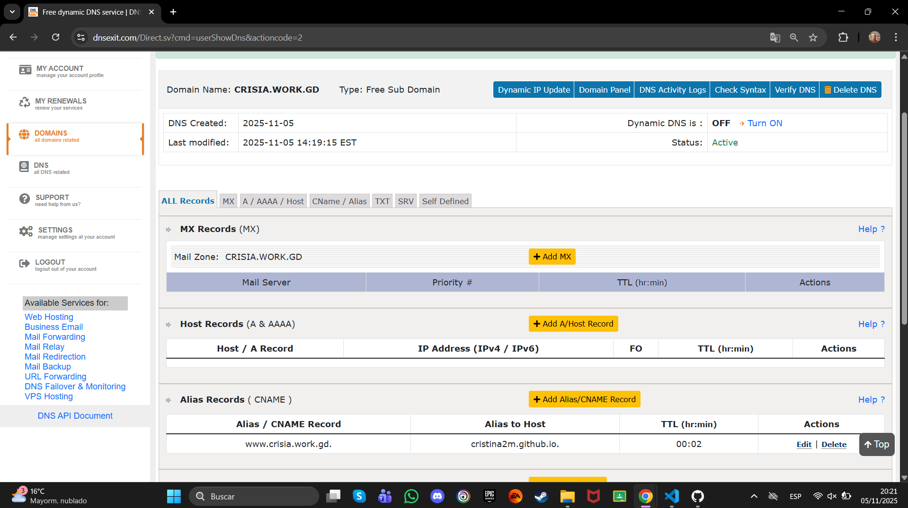

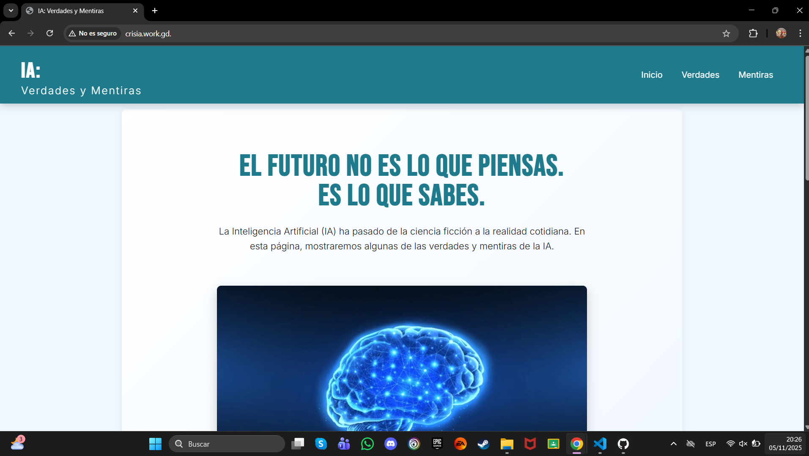

URL: www.crisia.work.gd.

